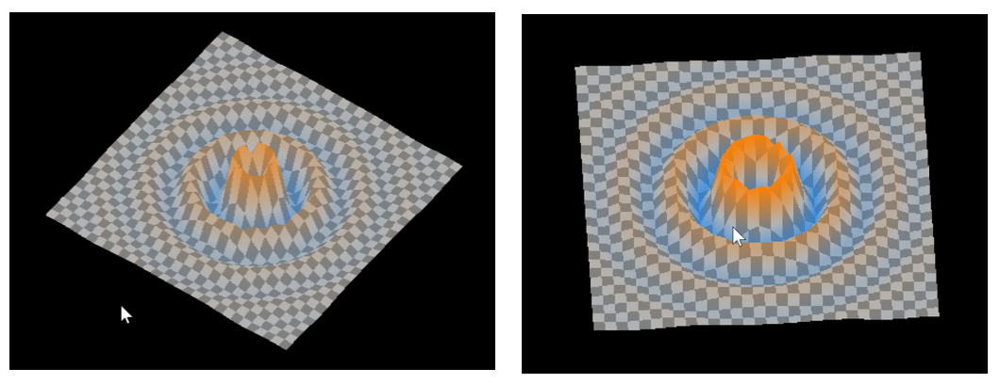
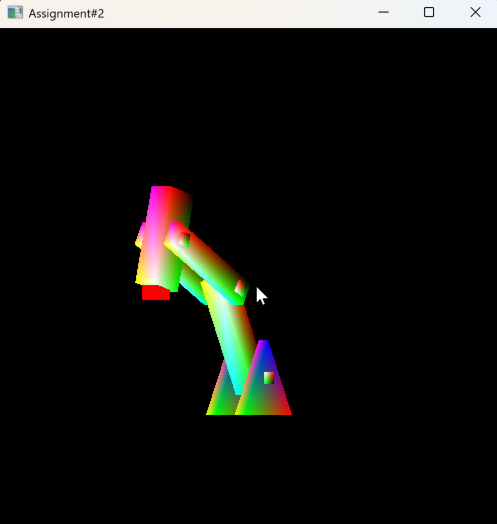

# ComputerGraphics_2025Fall

## Assignment1: Waving Plane
Naughty Waving Plane

Related Skills: 
- Vertex/Fragment Shader
- Sine, Cosine Function & Damping

Link: https://github.com/QjaYo/ComputerGraphics-Assignment1.git

## Assignment2: Robot Arm
Robot Arm that Tracks a Target

Related Skills:
- Rotation/Translation Matrix
- Forward Kinematics / Inverse Kinematics
- Iterative Method (Solving Complicated Non-Linear Equation)
  - Local Search
  - Gradient Descent
    - Jacobian Matrix

Link: https://github.com/QjaYo/ComputerGraphics-Assignment2.git
